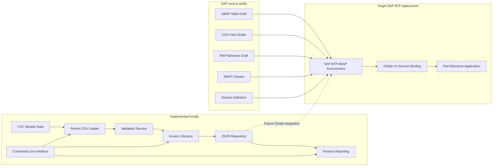
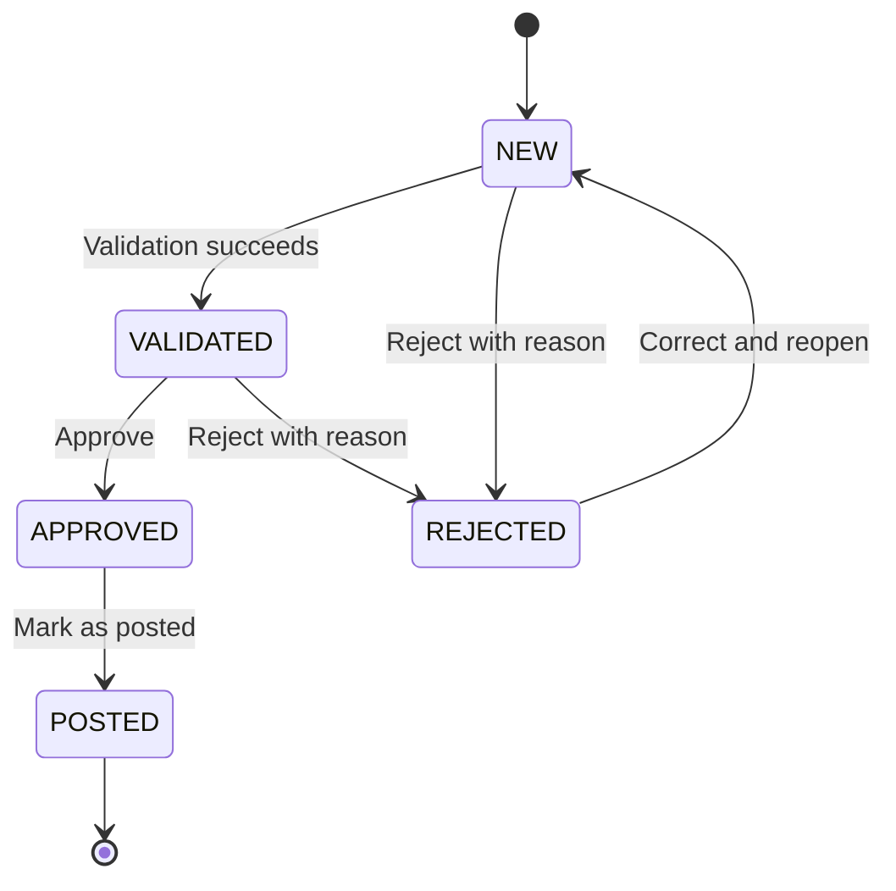

# SAP BTP ABAP Finance Process Extension

An educational portfolio project for modelling and implementing a finance invoice workflow across a local Python application and a planned SAP BTP ABAP Environment deployment.

The project demonstrates invoice validation, approval lifecycle management, local persistence, finance reporting, SAP ABAP Cloud concepts, Core Data Services, RAP, OData V4, Clean Core principles, and external system integration.

> **Project status:** In progress
> **Started:** July 2026
> **Local implementation:** Built, with testing and hardening in progress
> **SAP implementation:** Draft source created, deployment and activation pending
> **Target SAP environment:** SAP BTP ABAP Environment trial
> **Purpose:** Independent learning and portfolio development

## Project Overview

Finance teams often receive invoice data from multiple sources, including CSV files, internal systems, APIs, spreadsheets, and manual processes.

These records may contain missing fields, duplicate invoices, invalid amounts, unsupported currencies, inconsistent tax calculations, or incorrect workflow statuses. Such issues can delay approvals and create unreliable reporting.

This project models an invoice-processing workflow that:

1. Receives invoice records from CSV files or an external client.
2. Validates finance and workflow rules.
3. Detects duplicate and inconsistent records.
4. Moves valid invoices through a controlled lifecycle.
5. Stores invoice records locally for development and testing.
6. Produces finance summary reports.
7. Prepares SAP ABAP Cloud, RAP, CDS, and OData artifacts for deployment in SAP BTP.
8. Plans a Fiori Elements interface for finance users.
9. Connects a Python integration client to the future SAP OData service.

## Current Implementation Status

| Component                  | Status                           | Notes                                                          |
| -------------------------- | -------------------------------- | -------------------------------------------------------------- |
| Business requirements      | Completed                        | Documented in `docs/`                                          |
| System architecture        | Completed                        | Mermaid source included                                        |
| Invoice data model         | Completed locally                | SAP table draft requires activation                            |
| Invoice lifecycle          | Implemented locally              | SAP behavior implementation pending                            |
| Python domain model        | Implemented                      | Uses typed models and financial values                         |
| Validation rules           | Implemented locally              | Additional import validation hardening pending                 |
| Duplicate detection        | Implemented                      | Self-duplicate handling requires review                        |
| JSON persistence           | Implemented                      | Local development repository                                   |
| CSV import                 | Implemented                      | Row parsing works; business-rule integration is being improved |
| Finance reporting          | Implemented                      | Totals remain separated by currency                            |
| Command-line interface     | Implemented as a draft           | Parser and workflow verification pending                       |
| SAP OData client           | Implemented as a client skeleton | Requires a published SAP service                               |
| Python tests               | Added                            | Additional CLI and OData tests pending                         |
| ABAP database table        | Draft created                    | Not yet compiled or activated                                  |
| CDS views                  | Drafts created                   | Annotations and activation pending                             |
| RAP behavior               | Draft created                    | Validation and action logic pending                            |
| ABAP Unit tests            | Draft created                    | Assertions and SAP execution pending                           |
| OData V4 service           | Service definition drafted       | Service binding not yet created                                |
| Fiori Elements application | Planned                          | Requires SAP BTP deployment                                    |
| SAP screenshots            | Pending                          | Only genuine deployment screenshots will be added              |
| GitHub Actions             | Pending                          | CI workflow not yet configured                                 |

## Business Problem

The application addresses the following problems:

* Invoice records arrive from different upstream systems.
* Required fields may be missing.
* The same vendor invoice may be submitted more than once.
* Gross, tax, and net amounts may not reconcile.
* Unsupported currencies may be submitted.
* Workflow statuses may be changed incorrectly.
* Rejected invoices may not include a reason.
* Posted invoices should not be edited.
* Reporting requires consistent and validated records.
* External applications need a structured integration interface.

## Solution Architecture

The project currently contains a working local Python foundation and draft SAP artifacts.



## Invoice Lifecycle

The workflow uses five statuses:

* `NEW`
* `VALIDATED`
* `APPROVED`
* `REJECTED`
* `POSTED`



Blocked examples include:

* `NEW` to `APPROVED`
* `NEW` to `POSTED`
* `REJECTED` to `POSTED`
* `POSTED` to `NEW`
* `POSTED` to `APPROVED`

## Implemented Local Features

### Invoice model

The Python application includes an invoice model containing:

| Field               | Description                      |
| ------------------- | -------------------------------- |
| `invoice_uuid`      | Unique technical identifier      |
| `company_code`      | Finance company code             |
| `vendor_id`         | Vendor identifier                |
| `vendor_name`       | Vendor display name              |
| `invoice_number`    | Vendor invoice reference         |
| `invoice_date`      | Invoice date                     |
| `currency_code`     | Supported ISO currency           |
| `gross_amount`      | Total invoice amount             |
| `tax_amount`        | Tax component                    |
| `net_amount`        | Amount before tax                |
| `cost_center`       | Responsible cost center          |
| `description`       | Invoice description              |
| `processing_status` | Current workflow status          |
| `rejection_reason`  | Reason for rejection             |
| `error_message`     | Validation or processing message |
| `created_by`        | Record creator                   |
| `created_at`        | Creation timestamp               |
| `last_changed_by`   | Last modifying user              |
| `last_changed_at`   | Last modification timestamp      |

Financial values are modelled with decimal-based calculations rather than binary floating-point arithmetic.

### Validation rules

The local validation layer covers:

1. Company code is required.
2. Vendor ID is required.
3. Vendor name is required.
4. Invoice number is required.
5. Invoice date is required.
6. Currency must be supported.
7. Gross amount must be greater than zero.
8. Tax amount cannot be negative.
9. Net amount cannot be negative.
10. Net amount plus tax amount must equal gross amount within the configured tolerance.
11. Vendor ID and invoice number must be unique together.
12. Rejected invoices require a rejection reason.
13. Only valid workflow transitions are allowed.
14. Only approved invoices can be posted.
15. Posted invoices are intended to be immutable.

Supported currencies currently include:

```text
EUR
USD
GBP
CHF
```

### Local persistence

The project contains a JSON-backed repository for local development.

It supports:

* Adding invoices
* Reading an invoice by UUID
* Listing all invoices
* Updating records
* Deleting records
* Looking up an invoice by vendor ID and invoice number
* Reloading stored data between application runs

Runtime invoice data is stored locally and excluded from Git.

### CSV import

The repository includes fictional sample datasets for:

* Valid invoices
* Invalid invoices
* Duplicate invoices

The CSV loader currently supports:

* Header validation
* Date parsing
* Decimal parsing
* Currency normalization
* Status normalization
* Row-level parsing errors
* Separating successful and failed records

Full business-rule validation during CSV import is being strengthened.

### Finance reporting

The reporting layer calculates:

* Total invoice count
* Invoice count by status
* Gross amount by currency
* Approved amount by currency
* Posted amount by currency
* Rejected invoice count
* Validation-error count
* Unique vendor count
* Average gross amount by currency

Different currencies are never combined into one total.

### SAP OData client foundation

The Python package contains a client prepared for future SAP integration.

Planned and partially modelled operations include:

* List invoices
* Retrieve an invoice by UUID
* Create an invoice
* Update an invoice
* Execute RAP actions
* Handle HTTP errors
* Handle invalid JSON responses
* Use environment-based SAP configuration

The final URLs, entity names, payloads, CSRF handling, and action paths will be confirmed only after the SAP OData V4 service is published.

## SAP Development Artifacts

The `abap/` directory contains source drafts for:

* Invoice database table
* CDS interface view
* CDS projection view
* RAP behavior definition
* RAP behavior implementation class
* Invoice validation class
* Sample-data class
* Service definition
* ABAP Unit test class
* Manual OData V4 service-binding instructions

These files are portfolio development drafts.

> The ABAP source must be imported, adjusted where necessary, compiled, tested, and activated in an SAP BTP ABAP Environment before it can be described as working SAP code.

## SAP Object Naming

All custom SAP objects use the `ZNA_` prefix.

Examples:

```text
ZNA_FINANCE
ZNA_INVOICE
ZNA_I_INVOICE
ZNA_C_INVOICE
ZNA_BP_INVOICE
ZNA_SD_INVOICE
ZNA_UI_INVOICE_O4
ZNA_CL_INVOICE_VALIDATOR
ZNA_CL_INVOICE_DATA
```

## Technology Stack

### Implemented locally

* Python 3.11+
* Requests
* python-dotenv
* CSV
* JSON
* Decimal financial calculations
* pytest
* pytest-cov
* Ruff
* mypy
* Git
* GitHub
* Mermaid

### SAP technologies being developed

* SAP BTP ABAP Environment
* ABAP Cloud
* ABAP Objects
* Open SQL
* Core Data Services
* RESTful Application Programming Model
* OData V4
* Fiori Elements
* Clean Core principles
* Released API concepts
* Side-by-side extensibility

## Repository Structure

```text
.
├── README.md
├── LICENSE
├── .gitignore
├── pyproject.toml
├── requirements.txt
├── requirements-dev.txt
│
├── abap/
│   ├── database-tables/
│   ├── cds-views/
│   ├── behavior/
│   ├── classes/
│   ├── services/
│   └── tests/
│
├── diagrams/
│   ├── system-architecture.mmd
│   ├── invoice-lifecycle.mmd
│   └── data-model.mmd
│
├── docs/
│   ├── architecture.md
│   ├── api-contract.md
│   ├── business-requirements.md
│   ├── business-rules.md
│   ├── clean-core.md
│   ├── data-model.md
│   ├── sap-setup.md
│   ├── testing.md
│   └── screenshots/
│
├── python-client/
│   ├── .env.example
│   ├── src/
│   │   └── sap_finance_extension/
│   └── tests/
│
├── sample-data/
│   ├── valid_invoices.csv
│   ├── invalid_invoices.csv
│   └── duplicate_invoices.csv
│
└── scripts/
```

## Local Setup

### Requirements

* Python 3.11 or newer
* Git
* PowerShell, Bash, or another terminal

### Clone the repository

```powershell
git clone https://github.com/Noor-Ahmed-12/sap-btp-abap-finance-process-extension.git
cd sap-btp-abap-finance-process-extension
```

### Create a virtual environment

```powershell
python -m venv .venv
.\.venv\Scripts\Activate.ps1
```

### Install dependencies

```powershell
python -m pip install --upgrade pip
pip install -r requirements.txt
pip install -r requirements-dev.txt
```

### Run tests

```powershell
pytest
```

### Run quality checks

```powershell
ruff check .
mypy python-client/src
pytest --cov=python-client/src --cov-report=term-missing
```

### Run the CLI

The intended module command is:

```powershell
python -m sap_finance_extension.cli --help
```

Depending on the local environment, set the source directory first:

```powershell
$env:PYTHONPATH="$PWD\python-client\src"
```

Example intended commands:

```powershell
python -m sap_finance_extension.cli init
python -m sap_finance_extension.cli import-csv sample-data/valid_invoices.csv
python -m sap_finance_extension.cli list
python -m sap_finance_extension.cli summary
```

The CLI is currently undergoing final parser and workflow verification.

## Environment Configuration

Create a local `.env` file based on:

```text
python-client/.env.example
```

Expected variables:

```env
SAP_ODATA_URL=https://your-sap-service.example.com
SAP_USERNAME=your_username
SAP_PASSWORD=your_password
SAP_VERIFY_SSL=true
```

Do not commit the completed `.env` file.

## Testing

The repository currently contains Python tests for:

* Invoice validation
* Workflow lifecycle
* CSV loading
* Local persistence
* Finance reporting

Additional tests planned:

* CLI parser and command execution
* Self-duplicate validation
* Business validation during CSV import
* UTC timestamp save-and-reload
* Posted-invoice immutability
* SAP OData client requests
* HTTP timeouts and connection failures
* Invalid SAP JSON responses
* SAP action execution
* Corrupted local JSON storage

## Current Local Engineering Tasks

Before marking the local Python workflow as fully verified, the following items remain:

* [ ] Remove duplicate CLI subcommand registration
* [ ] Exclude the current invoice from duplicate checks
* [ ] Run business-rule validation during CSV import
* [ ] Standardize UTC timestamp serialization
* [ ] Enforce posted-invoice immutability
* [ ] Add CLI tests
* [ ] Add SAP OData client tests
* [ ] Confirm test coverage is at least 85%
* [ ] Confirm Ruff passes
* [ ] Confirm mypy passes
* [ ] Add GitHub Actions for automated quality checks

## SAP Deployment Roadmap

### Environment setup

* [ ] Create or activate an SAP BTP trial account
* [ ] Provision SAP BTP ABAP Environment
* [ ] Install Eclipse
* [ ] Install ABAP Development Tools
* [ ] Create an ABAP Cloud project
* [ ] Create the `ZNA_FINANCE` package

### Data model

* [x] Create local ABAP database-table draft
* [x] Create local CDS interface-view draft
* [x] Create local CDS projection-view draft
* [ ] Import objects into ADT
* [ ] Add final amount and currency semantics
* [ ] Add administrative and ETag fields
* [ ] Compile and activate objects

### RAP business object

* [x] Create managed RAP behavior draft
* [x] Create behavior implementation skeleton
* [x] Create validation-class skeleton
* [ ] Implement required-field validation in ABAP
* [ ] Implement amount validation in ABAP
* [ ] Implement duplicate-invoice validation in ABAP
* [ ] Implement workflow status checks
* [ ] Implement approve action
* [ ] Implement reject action
* [ ] Implement mark-as-posted action
* [ ] Return RAP failed and reported messages
* [ ] Compile and activate the business object

### Service and interface

* [x] Create service-definition draft
* [x] Document service-binding steps
* [ ] Create OData V4 service binding in ADT
* [ ] Publish the service
* [ ] Create Fiori Elements preview
* [ ] Add UI annotations
* [ ] Add filters and status actions
* [ ] Validate create and update behavior
* [ ] Validate approve, reject, and post actions

### External integration

* [x] Create Python OData client skeleton
* [x] Add environment-variable configuration
* [ ] Connect the client to the published SAP service
* [ ] Confirm the final entity paths
* [ ] Implement CSRF handling where required
* [ ] Read invoice records from SAP
* [ ] Create invoice records in SAP
* [ ] Update invoice records in SAP
* [ ] Execute RAP actions from Python
* [ ] Parse SAP validation-error payloads

### SAP quality evidence

* [x] Create ABAP Unit test draft
* [ ] Add meaningful ABAP Unit assertions
* [ ] Run ABAP tests in SAP
* [ ] Capture activation evidence
* [ ] Capture OData service evidence
* [ ] Capture Fiori Elements screenshots
* [ ] Add validation and workflow screenshots
* [ ] Record a short final project demonstration

## Clean Core Approach

The project follows Clean Core concepts by:

* Avoiding modification of SAP standard objects
* Using custom-named development objects
* Separating custom business logic from SAP standard functionality
* Planning to use released APIs where available
* Exposing functionality through supported OData services
* Keeping external integration logic outside the SAP core
* Using modular validation and workflow services
* Documenting extension boundaries and limitations

Because the SAP deployment is not yet complete, the repository does not claim production deployment inside a commercial SAP S/4HANA system.

## Security

The repository must never contain:

* SAP passwords
* Trial account credentials
* Authentication tokens
* Private SAP service URLs
* Client secrets
* Private keys
* Certificates
* Real supplier data
* Real invoice data
* Personal financial information

Only fictional sample records are used.

## Screenshots

The screenshots directory is intentionally incomplete until genuine SAP deployment evidence is available.

Planned screenshots include:

* SAP BTP trial environment
* ABAP Cloud project
* `ZNA_FINANCE` package
* Activated database table
* Activated CDS views
* RAP behavior definition
* OData V4 service binding
* Fiori Elements list report
* Invoice object page
* Validation error
* Approval action
* Rejection action
* Posted invoice
* Python finance summary

No generated or fabricated SAP screenshots will be used.

## Current Limitations

* The SAP source files are currently development drafts.
* The ABAP files have not yet been verified in a live SAP BTP ABAP Environment.
* The RAP behavior implementation is incomplete.
* The OData V4 service has not yet been published.
* The Fiori Elements application has not yet been previewed.
* The Python OData client is not connected to a live SAP service.
* The application does not post real accounting documents.
* The project is not connected to a commercial SAP S/4HANA Finance tenant.
* All vendor, invoice, and company data is fictional.
* Some local Python issues remain under active correction.
* SAP trial environments may expire, while the source code and documentation will remain available in GitHub.

## Future Improvements

After the initial SAP implementation is complete, possible extensions include:

* Released SAP finance API integration
* Role-based authorization
* Multi-level invoice approval
* Attachment handling
* Audit-log reporting
* Vendor master-data validation
* Cost-center validation
* Scheduled invoice import
* SAP Analytics Cloud reporting
* SAP Build Process Automation integration
* BTP event-driven integration
* Deployment of an external integration service
* Automated GitHub Actions quality checks
* Docker packaging for the Python component

## Learning Objectives

This project is intended to develop and demonstrate practical understanding of:

* SAP BTP ABAP Environment
* ABAP Cloud
* ABAP Objects
* Open SQL
* Core Data Services
* RAP business objects
* OData V4
* Fiori Elements
* Clean Core principles
* Side-by-side extensibility
* Finance-process modelling
* Python-to-SAP integration
* End-to-end data tracing
* Workflow validation
* Software testing
* Technical documentation
* Production-minded error handling

## Author

**Noor Ahmed Shaikh**

* LinkedIn: [linkedin.com/in/noor-ahmedd](https://www.linkedin.com/in/noor-ahmedd/)
* GitHub: [github.com/Noor-Ahmed-12](https://github.com/Noor-Ahmed-12)
* Portfolio: [noorahmedshaikh.vercel.app](https://noorahmedshaikh.vercel.app/)

## License

This project is available under the MIT License.

## Disclaimer

This is an independent educational portfolio project. It is not affiliated with, endorsed by, or developed on behalf of SAP, FINN, or any other company.

SAP product names and trademarks belong to their respective owners.