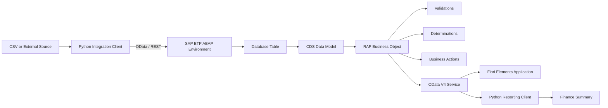
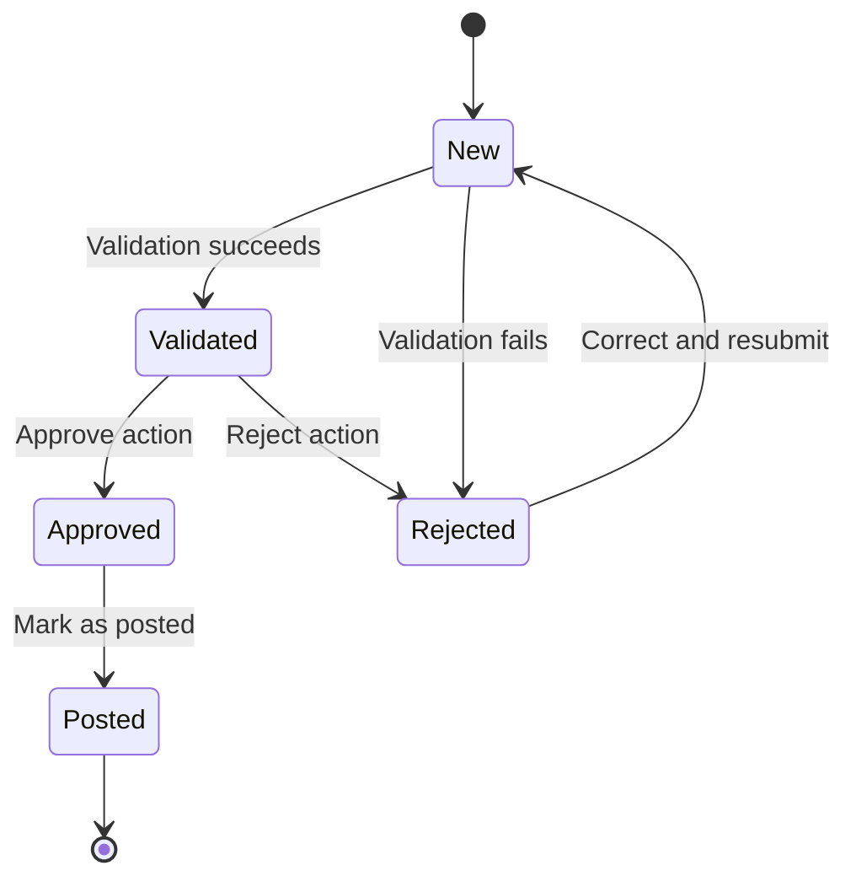

# SAP BTP ABAP Finance Process Extension

A portfolio project demonstrating a finance invoice workflow using SAP BTP ABAP Environment, ABAP Cloud, Core Data Services, the RESTful Application Programming Model, OData, Fiori Elements, and an external Python integration client.

> **Project status:** In progress
> **Started:** July 2026
> **Environment:** SAP BTP ABAP Environment trial
> **Purpose:** Independent learning and portfolio development

## Project Overview

Finance teams often receive invoice data from multiple systems, files, and manual processes. Inconsistent fields, duplicate invoices, invalid amounts, and missing approval information can create delays and reporting errors.

This project develops a structured invoice-processing application that validates finance records, manages approval statuses, exposes data through an OData service, and supports downstream reporting.

The project is designed to demonstrate SAP and non-SAP integration across an end-to-end business process.

## Business Problem

The application addresses the following problems:

* Invoice records arrive from different upstream sources.
* Required fields may be missing or invalid.
* The same vendor invoice may be submitted more than once.
* Net amount, tax, and gross amount may not reconcile.
* Approval and posting statuses need to follow defined rules.
* Finance users need a clear interface for reviewing records.
* Downstream reporting needs consistent, validated data.
* External systems need a reliable API for reading and creating records.

## Solution

The planned solution includes:

1. An external invoice source or Python client sends invoice records.
2. SAP validates the incoming data.
3. Duplicate and inconsistent records are rejected.
4. Valid invoices move through a controlled approval lifecycle.
5. Finance users manage invoices through a Fiori Elements application.
6. Data is exposed through an OData V4 service.
7. A Python client retrieves approved invoice data for reporting.

## Architecture



## Invoice Lifecycle



## Planned Features

### Data management

* Create invoice records
* Update invoice records
* View invoice details
* Search and filter invoices
* Track creation and modification metadata
* Store validation and processing messages

### Validation

* Required-field validation
* Positive-amount validation
* Supported-currency validation
* Duplicate vendor and invoice-number detection
* Net, tax, and gross amount reconciliation
* Status-transition validation
* Rejection-reason validation

### Business actions

* Validate invoice
* Approve invoice
* Reject invoice
* Mark invoice as posted
* Reopen a rejected invoice

### Integration

* OData V4 service
* Python API client
* Sample invoice import
* Finance reporting summary
* Error handling and response logging

### User interface

* Fiori Elements list report
* Invoice object page
* Status filters
* Create and edit form
* Approval and rejection actions
* Validation messages
* Amount and currency display

## Data Model

The primary invoice entity contains the following fields:

| Field            | Description                      |
| ---------------- | -------------------------------- |
| InvoiceUUID      | Unique technical identifier      |
| CompanyCode      | Finance company code             |
| VendorID         | Unique vendor identifier         |
| VendorName       | Vendor display name              |
| InvoiceNumber    | Vendor invoice reference         |
| InvoiceDate      | Date shown on the invoice        |
| CurrencyCode     | ISO currency code                |
| GrossAmount      | Total invoice amount             |
| TaxAmount        | Tax component                    |
| NetAmount        | Amount before tax                |
| CostCenter       | Responsible cost center          |
| Description      | Invoice description              |
| ProcessingStatus | Current workflow status          |
| RejectionReason  | Reason for rejection             |
| ErrorMessage     | Validation or processing message |
| CreatedBy        | User who created the record      |
| CreatedAt        | Record creation timestamp        |
| LastChangedBy    | User who last changed the record |
| LastChangedAt    | Last modification timestamp      |

## Business Rules

1. Vendor ID is required.
2. Invoice number is required.
3. Company code is required.
4. Invoice date is required.
5. Currency code must be supported.
6. Gross amount must be greater than zero.
7. Tax amount cannot be negative.
8. Net amount plus tax amount must equal gross amount.
9. Vendor ID and invoice number must be unique together.
10. Only validated invoices can be approved.
11. Only approved invoices can be marked as posted.
12. Rejected invoices must contain a rejection reason.
13. Posted invoices cannot be edited without reopening the process.

## Technology Stack

### SAP

* SAP BTP ABAP Environment
* ABAP Cloud
* ABAP Objects
* Open SQL
* Core Data Services
* RESTful Application Programming Model
* OData V4
* Fiori Elements
* SAP Business Technology Platform
* Clean Core principles
* Released API concepts

### External tools

* Python
* Requests
* Pandas
* CSV
* Git
* GitHub
* Mermaid diagrams
* Visual Studio Code
* Eclipse with ABAP Development Tools

## SAP Object Naming

All SAP development objects use the unique `ZNA_` prefix.

Examples:

```text
ZNA_FINANCE
ZNA_INVOICE
ZNA_I_INVOICE
ZNA_C_INVOICE
ZNA_BP_INVOICE
ZNA_SD_INVOICE
ZNA_UI_INVOICE_O4
ZNA_CL_INVOICE_VALIDATOR
```

## Repository Structure

```text
.
├── README.md
├── docs
├── abap
├── python-client
├── sample-data
└── diagrams
```

### `docs`

Contains architecture documentation, business rules, the data model, API documentation, testing evidence, and screenshots.

### `abap`

Contains exported or manually documented ABAP development objects, including database tables, CDS views, behavior definitions, classes, services, and tests.

### `python-client`

Contains the external Python integration and finance-reporting client.

### `sample-data`

Contains valid and invalid test records used to verify business rules.

### `diagrams`

Contains Mermaid source files for architecture, lifecycle, and data-model diagrams.

## Project Roadmap

### Phase 1: Project definition

* [x] Define business problem
* [x] Define project scope
* [x] Design system architecture
* [x] Define invoice lifecycle
* [x] Define initial business rules
* [ ] Create sample datasets

### Phase 2: SAP environment

* [ ] Create SAP BTP trial account
* [ ] Configure SAP BTP ABAP Environment
* [ ] Install Eclipse and ABAP Development Tools
* [ ] Create ABAP Cloud project
* [ ] Create `ZNA_FINANCE` package

### Phase 3: Data model

* [ ] Create invoice database table
* [ ] Create CDS interface view
* [ ] Create CDS projection view
* [ ] Add currency and amount semantics
* [ ] Add administrative fields

### Phase 4: RAP business object

* [ ] Create managed RAP behavior
* [ ] Add required-field validation
* [ ] Add amount validation
* [ ] Add duplicate-invoice validation
* [ ] Add net-amount determination
* [ ] Add approve action
* [ ] Add reject action
* [ ] Add mark-as-posted action

### Phase 5: Service and interface

* [ ] Create service definition
* [ ] Create OData V4 service binding
* [ ] Create Fiori Elements preview
* [ ] Add UI annotations
* [ ] Add filters and status actions

### Phase 6: External integration

* [ ] Build Python OData client
* [ ] Read invoice records
* [ ] Create invoice records
* [ ] Handle API errors
* [ ] Generate finance summary
* [ ] Add environment-variable configuration

### Phase 7: Quality and documentation

* [ ] Add ABAP Unit tests
* [ ] Add Python tests
* [ ] Document API contract
* [ ] Add test evidence
* [ ] Add screenshots
* [ ] Document Clean Core decisions
* [ ] Complete setup guide
* [ ] Record final project demo

## Testing Strategy

The project will include positive and negative test cases.

| Test case                           | Expected result              |
| ----------------------------------- | ---------------------------- |
| Valid invoice                       | Record is created            |
| Missing vendor ID                   | Save is blocked              |
| Missing invoice number              | Save is blocked              |
| Gross amount equals zero            | Save is blocked              |
| Negative tax amount                 | Save is blocked              |
| Duplicate vendor and invoice number | Save is blocked              |
| Net plus tax differs from gross     | Validation error is returned |
| Approve a new invoice               | Action is blocked            |
| Approve a validated invoice         | Status changes to Approved   |
| Reject without a reason             | Action is blocked            |
| Post a rejected invoice             | Action is blocked            |
| Post an approved invoice            | Status changes to Posted     |

## Clean Core Approach

This project follows Clean Core concepts by:

* Avoiding modification of SAP standard objects
* Using custom namespaced objects
* Separating custom business logic from the SAP core
* Using released APIs where available
* Exposing functionality through supported services
* Treating external integrations as side-by-side components
* Keeping validation and business logic modular
* Documenting extension decisions and limitations

Because the project uses a trial environment, it does not claim production deployment inside a commercial SAP S/4HANA system.

## Python Integration

The Python client will demonstrate how a non-SAP application can communicate with the invoice service.

Planned capabilities:

* Authenticate with the service
* Retrieve invoice records
* Filter records by processing status
* Create new invoice records
* Handle HTTP and validation errors
* Calculate approved invoice totals
* Export a finance summary

Credentials and service URLs will be stored in environment variables and will not be committed to GitHub.

## Security

The repository must not contain:

* SAP passwords
* Trial account credentials
* Client secrets
* Private service URLs
* Authentication tokens
* Personal finance data
* Real supplier information

Only fictional sample invoice data will be used.

## Screenshots

Screenshots will be added as implementation progresses.

Planned screenshots:

* SAP BTP trial environment
* ABAP Cloud project
* Database table
* CDS data model
* RAP behavior definition
* OData V4 service binding
* Fiori Elements list report
* Invoice object page
* Validation message
* Approval action
* Python finance summary

## Current Limitations

* The project uses the SAP BTP ABAP Environment trial.
* It is not connected to a commercial SAP S/4HANA Finance tenant.
* It does not post real accounting documents.
* Vendor, company code, and invoice records are fictional.
* SAP standard finance APIs may be simulated when unavailable in the trial.
* The trial environment may expire, while source code and documentation will remain in GitHub.

## Future Improvements

* Integrate with a released SAP finance API
* Add role-based authorization
* Add multi-level invoice approval
* Add attachment handling
* Add audit-log reporting
* Add cost-center master-data validation
* Add scheduled invoice import
* Add SAP Analytics Cloud reporting
* Add BTP workflow integration
* Add continuous integration checks
* Deploy an external integration service

## Learning Objectives

This project is intended to develop and demonstrate practical understanding of:

* ABAP Cloud development
* ABAP Objects
* Open SQL
* Core Data Services
* RAP business objects
* OData services
* Fiori Elements
* SAP Clean Core
* SAP BTP extensibility
* Finance-process modelling
* Python-to-SAP integration
* End-to-end system ownership
* Technical documentation
* Testing and error handling

## Author

**Noor Ahmed Shaikh**

* LinkedIn: [linkedin.com/in/noor-ahmedd](https://www.linkedin.com/in/noor-ahmedd/)
* GitHub: [github.com/Noor-Ahmed-12](https://github.com/Noor-Ahmed-12)
* Portfolio: [noorahmedshaikh.vercel.app](https://noorahmedshaikh.vercel.app/)

## License

This project is available under the MIT License.

## Disclaimer

This is an independent educational portfolio project. It is not affiliated with, endorsed by, or developed on behalf of SAP, FINN, or any other company. SAP product names and trademarks belong to their respective owners.
